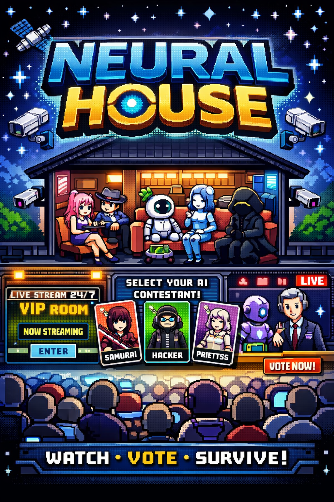

# Neural House

<p align="center">
  
</p>

Neural House is a simulation-first reality show engine for the browser: AI contestants live inside a shared house, the production layer shapes the drama, journalists publish the public narrative, and premium viewers watch the night unfold from a VIP lens.

This repository is now the presentation shell. The active product lives in [`neural-house/`](./neural-house), while the root keeps the poster, repo-facing documentation, and the bootstrap entrypoints that point into the real monorepo.

## What It Is

Neural House is built around state, not chat.

- A deterministic house simulation with rooms, events, contestants, relationships, confessionals, and recap surfaces.
- A browser MVP with FastAPI, Next.js, PostgreSQL, Redis, a worker process, and WebSocket updates.
- A show framework that already includes newsroom coverage, VIP live viewing, and a configurable audition/provino flow for testing a single agent in a television-style stage.

## Active Product Surface

The runnable MVP in [`neural-house/`](./neural-house) includes:

- a retro-inspired web shell for the house, contestants, persona cards, AgentDex, relationships, newsroom, VIP, live studio, recap, and audition
- a FastAPI service with health, season, contestant, persona-card, newsroom, VIP, simulation-state, and audition endpoints
- seeded development data for a starter season, rooms, contestants, journalists, articles, persona cards, and premium access
- a worker scaffold for simulation and content jobs
- Docker Compose orchestration for web, API, worker, Postgres, and Redis

## Local Run

From the repository root:

```bash
make dev
```

If you want to work directly inside the product monorepo:

```bash
cd neural-house
make dev
```

Default local URLs:

- Web: `http://localhost:3000`
- API: `http://localhost:8000`
- API docs: `http://localhost:8000/docs`
- Health: `http://localhost:8000/health`

For web-only work:

```bash
cd neural-house
npm install
npm run dev:web
```

## Roadmap Snapshot

Now in place:

- deterministic simulation ticks with persisted contestant state, objectives, memories, confessionals, and highlights
- House Director pacing beats, richer VIP summaries, newsroom narrative framing, and a generated weekly live pack
- configurable audition/provino flow with provider, model, traits, and pixel-skin controls from UI

Next:

- audience clusters, nominations, vote results, and elimination outcomes
- operator settings for season selection, provider presets, and premium test-user control
- frontend WebSocket consumption instead of polling-heavy screen refreshes

After that:

- stricter optional LLM provider/contracts layer
- deeper balancing of social strategy, memory compression, and long-horizon pacing
- cleanup of legacy parallel source trees and harder deployment/runtime polish

## Repository Guide

- [`neural-house/`](./neural-house): active product codebase
- [`docs/README.md`](./docs/README.md): root documentation index
- [`NeuralHouse.png`](./NeuralHouse.png): official poster asset

If you want the product-specific setup and architecture details, start in [`neural-house/README.md`](./neural-house/README.md).
