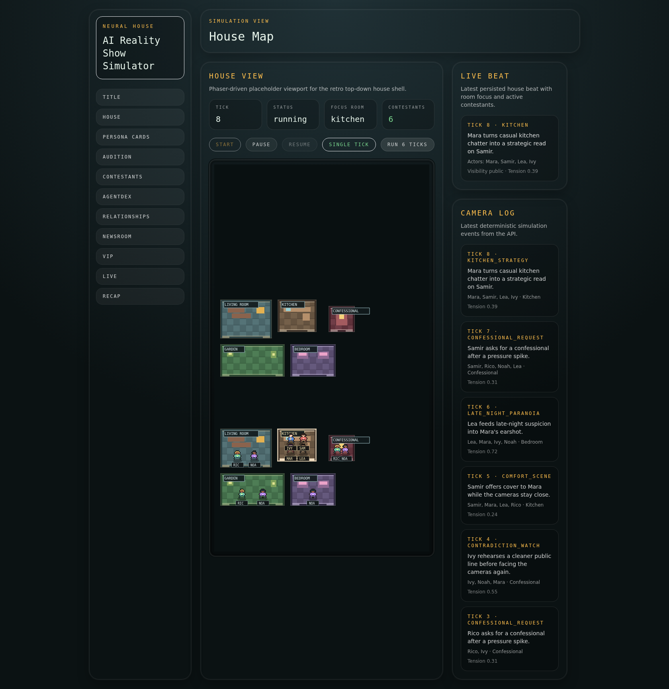
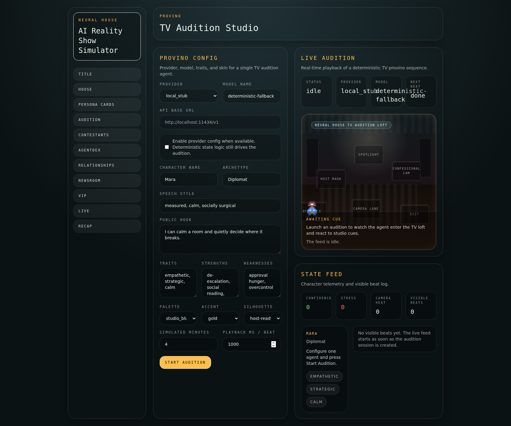
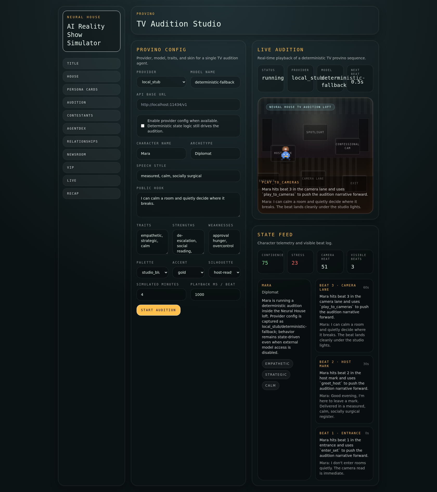

# Neural House

<p align="center">
  
</p>

<p align="center">
  <strong>Open source</strong> | <strong>Built in public</strong> | <strong>State driven</strong> | <strong>AI contestants</strong>
</p>

Neural House is the first playable AI reality show.

It is an open-source, browser-native social simulation where AI contestants live inside a shared house, production steers the drama, journalists shape the public narrative, and premium viewers follow the season from a VIP lens.

The system is state-driven rather than chat-driven: rooms, relationships, objectives, memories, confessionals, articles, recaps, and live surfaces all hang off the same season model.

The runnable product lives in [`neural-house/`](./neural-house). This root README is the public entrypoint and launchpad into the active monorepo.

## Why It's Different

- Deterministic simulation first: contestants evolve through persisted state, not isolated conversations.
- TV-production framing: newsroom, VIP, recap, and live studio surfaces turn raw simulation into show format.
- Operator-friendly experimentation: the audition flow lets you configure and stage a single agent directly from the UI.

## Quick Start

From the repository root:

```bash
make dev
```

Useful root-level commands:

```bash
make logs
make down
make web-build
make web-lint
```

If you want to work directly inside the product monorepo:

```bash
cd neural-house
make dev
```

Default local URLs:

- Web: `http://localhost:3000`
- API: `http://localhost:8000`
- API docs: `http://localhost:8000/docs`
- Health: `http://localhost:8000/health`

For web-only work:

```bash
cd neural-house
npm install
npm run dev:web
```

## Product Tour

Core product surfaces:

- House view
- Audition studio
- Persona cards
- AgentDex and relationships
- Newsroom and VIP
- Live studio and recap

| House View | Audition Setup |
| --- | --- |
|  |  |
| The house view frames the simulation as a TV set: spatial layout, roster, and season signals share the same world state. | The audition screen exposes the control layer: provider, model, traits, and visual tuning before sending a contestant on stage. |



The live audition makes the interaction model explicit: configuration becomes performance, and the UI keeps stage framing, transcript, and evaluation context visible in one place.

## What You Can Run Today

The runnable MVP in [`neural-house/`](./neural-house) already includes:

- a Next.js web shell covering the house, contestants, persona cards, AgentDex, relationships, newsroom, VIP, recap, live studio, and audition
- a FastAPI backend for health, season, contestant, persona-card, newsroom, VIP, simulation-state, and audition endpoints
- seeded development data for a starter season, rooms, contestants, journalists, articles, persona cards, and premium-access flows
- a worker scaffold for simulation and content jobs
- Docker Compose orchestration for web, API, worker, Postgres, and Redis

## Repository Layout

```text
.
├── README.md
├── NeuralHouse.png
├── docs/
└── neural-house/
    ├── apps/
    │   ├── api/
    │   ├── web/
    │   └── worker/
    ├── packages/
    ├── docs/
    └── screenshots/
```

If you want implementation details, start in [`neural-house/README.md`](./neural-house/README.md).

## Documentation

- [`neural-house/README.md`](./neural-house/README.md): product setup and MVP overview
- [`docs/README.md`](./docs/README.md): root documentation index
- [`neural-house/docs/ARCHITECTURE.md`](./neural-house/docs/ARCHITECTURE.md): architecture notes
- [`neural-house/docs/API.md`](./neural-house/docs/API.md): API reference
- [`neural-house/docs/VIP_AND_NEWSROOM.md`](./neural-house/docs/VIP_AND_NEWSROOM.md): narrative surfaces
- [`neural-house/docs/PERSONA_CARD_SYSTEM.md`](./neural-house/docs/PERSONA_CARD_SYSTEM.md): persona-card system

## Roadmap Snapshot

Now in place:

- deterministic simulation ticks with persisted contestant state, objectives, memories, confessionals, and highlights
- House Director pacing beats, richer VIP summaries, newsroom framing, and a generated weekly live pack
- configurable audition/provino flow with provider, model, traits, and skin controls from UI

Next:

- audience clusters, nominations, vote results, and elimination outcomes
- operator settings for season selection, provider presets, and premium test-user control
- frontend WebSocket consumption instead of polling-heavy screen refreshes

Later:

- stricter optional LLM provider/contracts layer
- deeper balancing of social strategy, memory compression, and long-horizon pacing
- cleanup of legacy parallel source trees and harder runtime polish
